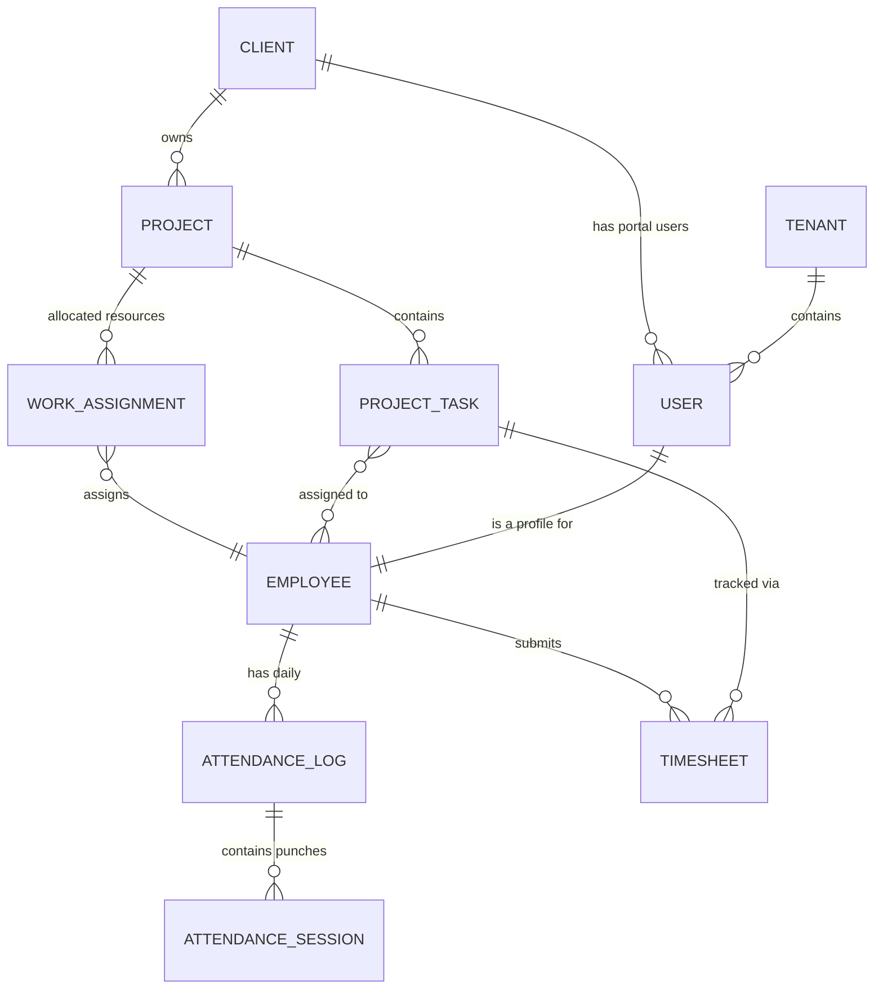

# KNR-HRMS: Core System Architecture & Data Flows

This document outlines the core database entities and their interconnections for the KNR-HRMS platform, focusing on Users, Employees, Attendance, Projects, and Clients.

## 1. Core Identity: Users & Employees
The system separates authentication (`User`) from professional profile (`Employee`).

### 1.1 Tables & Relationships
- **`users`**: Authentication, MFA, and high-level role/tenant association.
    - `id`: Primary Key.
    - `email`, `password`: Auth credentials.
    - `client_id`: (Nullable) Links a User to a Client (for Client Portal).
    - `employee_id`: (Nullable) Direct link to Employee profile.
- **`employees`**: Detailed professional data.
    - `id`: Primary Key.
    - `user_id`: Reference to `users.id` (1:1 relationship).
    - `reporting_to`: Reference to `users.id` (Manager).
    - `department_id`: Reference to `departments.id`.
    - `status`: Active, Inactive, Terminated, etc.

### 1.2 Flow
1. A **User** is created for login.
2. An **Employee** profile is attached to the User to store HR-specific data (salary, documents, department).
3. Access control is handled via **Roles** and **Permissions** attached to the User.

---

## 2. Attendance & Time Tracking
The attendance system tracks presence (logs) and actual work (timesheets).

### 2.1 Attendance Flow (Log-based)
- **`attendance_policies`**: Defines rules (grace periods, half-day thresholds). Attached to Employee or Department.
- **`shifts`**: Defines working hours (start/end time).
- **`attendance_logs`**: Daily summary for an employee.
    - Linked to `employees` and `shifts`.
    - Stores `total_work_minutes`, `is_late`, `status` (Present/Absent).
- **`attendance_sessions`**: Individual punch-in/out records.
    - Linked to `attendance_logs` (1:N).
    - Stores `in_time`, `out_time`, `ip_address`.

### 2.2 Time Tracking Flow (Task-based)
- **`timesheets`**: Granular tracking of work hours.
    - Linked to `employees`, `projects`, and `project_tasks`.
    - Stores `hours_spent`, `task_description`, `is_billable`.

---

## 3. Project Management
Manages the lifecycle of work assigned to teams.

### 3.1 Hierarchy
1. **`clients`**: The owner of the project.
2. **`projects`**: The high-level container.
3. **`project_modules`**: Logical sections of a project.
4. **`sprints`**: Time-boxed periods for tasks.
5. **`project_tasks`**: Individual units of work.

### 3.2 Tables & Relationships
- **`projects`**:
    - `client_id`: Links to the Client.
    - `status`: planning, active, on_hold, completed.
- **`work_assignments`**: A polymorphic bridge table.
    - Links `Employee` or `User` to a `Project` (Project-level assignment) or `Task`.
- **`project_tasks`**:
    - `project_id`, `module_id`, `sprint_id`, `stage_id`.
    - `created_by`: Reference to `users.id`.
- **`task_assignees`**: Many-to-Many link between `project_tasks` and `employees`.

---

## 4. Client Relations
Handles external stakeholders and their access.

### 4.1 Tables
- **`clients`**: Primary entity for customers.
    - Stores contract dates and portal access status.
- **`client_users`**: Specific profile for client-side users.
- **`bug_tickets`**: (In `CRM` or `Project` module) Often reported by clients.
    - Linked to `projects` and sometimes `project_tasks`.

---

## 5. Visual Interconnection Map (Mermaid)

## 6. Code-wise Logic Points
- **Access Control**: `App\Models\User::hasPermission()` and `v-can` directive in Vue.
- **Filtering**: `App\Traits\FilterableByAccess` is used in models like `Employee` and `Project` to restrict data based on the user's role (Self, Team, Department, or Global).
- **Logging**: `App\Services\Infrastructure\LoggerService` handles business logic audit trails.
- **Modals & Forms**: Standardized in `resources/js/Components` using `Modal.vue`, `TextInput.vue`, etc.
